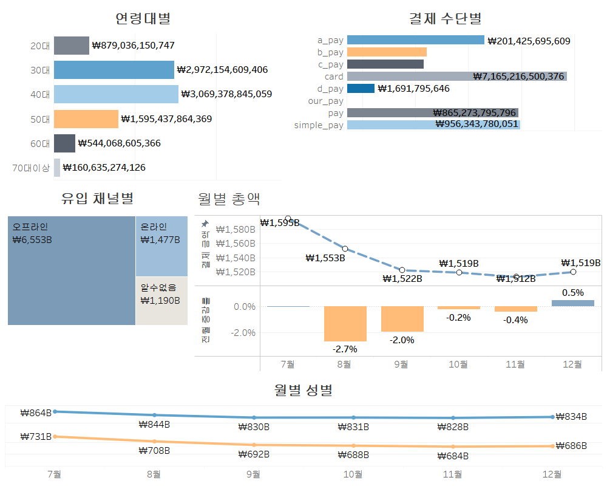
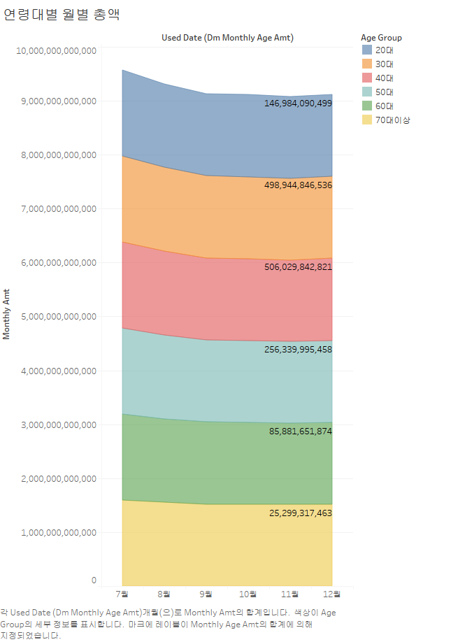
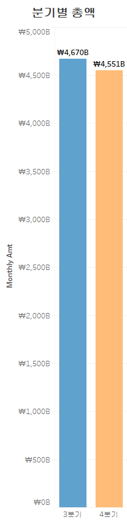

# 스타 스키마 실습

## 개요
- 6개월치의 카드 사용 금액 데이터셋을 사용하여 스타 스키마 구조를 생성하고 카드 사용금액 대시보드를 생성하였습니다.

## 데이터셋
- [AI 허브 사이트](https://www.aihub.or.kr/aihubdata/data/view.do?currMenu=115&topMenu=100&&srchDataRealmCode=REALM015&aihubDataSe=data&dataSetSn=71792)에서 제공하는 금융 합성 데이터를 활용하였습니다. 
- 총 12개의 압축 파일로 구성되어 있으며, 이 중 '**01.카드 회원정보**'와 '**03.카드 승인매출정보**' 데이터를 사용하였습니다.
- 각 파일들은  **2018년 7월부터 2018년 12월까지**의 6개의 CSV 파일들로 구성되어 있으며, 각 CSV 파일들은 **300만 건의 레코드**를 포함하고 있습니다.

## ERD 다이어그램

## 아키텍처


## 진행과정
  ### 1. 데이터 병합
  - '**01.카드 회원정보**'와 '**03.카드 승인매출정보**'에서 필요한 컬럼들만 추출
  - **1800만 건의 레코드**를 포함하는 2개의 원본 테이블 생성
  
  ### 2. 원본 테이블    
  - #### `member_info` - 카드회원 정보 (2018/07 ~ 2018/12)
    - 79개의 컬럼 중 6개의 컬럼 추출
    - 추출한 컬럼 : **`기준년월`**, **`발급회원번호`**, **`남녀구분코드`**, **`연령`**, **`거주시도명`**, **`직장시도명`**

  - #### `payment_amt` - 승인매출 정보 (2018/07 ~ 2018/12)
    - 430개의 컬럼 중 13개 컬럼 추출
    - 추출한 컬럼 : **`기준년월`**, **`발급회원번호`**, **`이용금액_온라인_B0M`**, **`이용금액_오프라인_B0M`**, **`이용금액_페이_온라인_B0M`**, **`이용금액_페이_오프라인_B0M`**, **`이용금액_당사페이_B0M`**, **`이용금액_A페이_B0M`**, **`이용금액_B페이_B0M`**, **`이용금액_C페이_B0M`**, **`이용금액_D페이_B0M`**, **`이용금액_간편결제_B0M`**

  
   
  ### 3. 차원 테이블 및 팩트 테이블
  - 팩트 테이블
    - #### `fact_monthly_amt` - 월별 결제 금액
        | 컬럼명 | 설명 | 타입 |
        | --- | --- | --- |
        | `date_key` | 날짜 Key (**기준년월**) | INT (**FK**) |
        | `member_key` | 고객 Key | VARCHAR (**FK**) |
        | `payment_key` | 결제 수단 Key | INT (**FK**) |
        | `channel_key` | 결제 채널 Key | INT (**FK**) |
        | `total_amt` | 결제 금액 | INT |
    
      <details>
      <summary>쿼리문</summary>
        
        - 병합한 2개의 테이블에서 월별 고객별 지불 수단별 총합의 결과를 unpivot을 사용하여 생성하였습니다. 
  
      ```sql
      CREATE TABLE fact.fact_total_amt AS
      WITH unpivoted AS 
      (
          SELECT 기준년월 AS date_key, 발급회원번호 AS member_key, '이용금액_온라인_B0M' AS col_name, 이용금액_온라인_B0M AS total_amt FROM card_usage.payment_amt WHERE 이용금액_온라인_B0M IS NOT NULL
          UNION ALL
          SELECT 기준년월, 발급회원번호, '이용금액_오프라인_B0M', 이용금액_오프라인_B0M FROM card_usage.payment_amt WHERE 이용금액_오프라인_B0M IS NOT NULL
          UNION ALL
          SELECT 기준년월, 발급회원번호, '이용금액_페이_온라인_B0M', 이용금액_페이_온라인_B0M FROM card_usage.payment_amt WHERE 이용금액_페이_온라인_B0M IS NOT NULL
          UNION ALL
          SELECT 기준년월, 발급회원번호, '이용금액_페이_오프라인_B0M', 이용금액_페이_오프라인_B0M FROM card_usage.payment_amt WHERE 이용금액_페이_오프라인_B0M IS NOT NULL
          UNION ALL
          SELECT 기준년월, 발급회원번호, '이용금액_당사페이_B0M', 이용금액_당사페이_B0M FROM card_usage.payment_amt WHERE 이용금액_당사페이_B0M IS NOT NULL
          UNION ALL
          SELECT 기준년월, 발급회원번호, '이용금액_A페이_B0M', 이용금액_A페이_B0M FROM card_usage.payment_amt WHERE 이용금액_A페이_B0M IS NOT NULL
          UNION ALL
          SELECT 기준년월, 발급회원번호, '이용금액_B페이_B0M', 이용금액_B페이_B0M FROM card_usage.payment_amt WHERE 이용금액_B페이_B0M IS NOT NULL
          UNION ALL
          SELECT 기준년월, 발급회원번호, '이용금액_C페이_B0M', 이용금액_C페이_B0M FROM card_usage.payment_amt WHERE 이용금액_C페이_B0M IS NOT NULL
          UNION ALL
          SELECT 기준년월, 발급회원번호, '이용금액_D페이_B0M', 이용금액_D페이_B0M FROM card_usage.payment_amt WHERE 이용금액_D페이_B0M IS NOT NULL
          UNION ALL
          SELECT 기준년월, 발급회원번호, '이용금액_간편결제_B0M', 이용금액_간편결제_B0M FROM card_usage.payment_amt WHERE 이용금액_간편결제_B0M IS NOT NULL
      ), with_keys AS (
          SELECT
              date_key,
              member_key,
              CASE col_name
                  WHEN '이용금액_온라인_B0M' THEN 1
                  WHEN '이용금액_오프라인_B0M' THEN 1
                  WHEN '이용금액_페이_온라인_B0M' THEN 2
                  WHEN '이용금액_페이_오프라인_B0M' THEN 2
                  WHEN '이용금액_당사페이_B0M' THEN 3
                  WHEN '이용금액_A페이_B0M' THEN 4
                  WHEN '이용금액_B페이_B0M' THEN 5
                  WHEN '이용금액_C페이_B0M' THEN 6
                  WHEN '이용금액_D페이_B0M' THEN 7
                  WHEN '이용금액_간편결제_B0M' THEN 8
              END AS payment_key,
              CASE col_name
                  WHEN '이용금액_온라인_B0M' THEN 1
                  WHEN '이용금액_오프라인_B0M' THEN 2
                  WHEN '이용금액_페이_온라인_B0M' THEN 1
                  WHEN '이용금액_페이_오프라인_B0M' THEN 2
                  ELSE -1
              END AS channel_key,
              total_amt
          FROM unpivoted
      )
      SELECT
          date_key,
          member_key,
          payment_key,
          channel_key,
          SUM(total_amt) AS total_amt
      FROM with_keys
      GROUP BY date_key, member_key, payment_key, channel_key
      ```
  
      </details>
      
    <details>
    <summary>차원 테이블</summary>
  
    - #### `dim_member` - 회원
  
    | 컬럼명 | 설명 | 타입 |
    | --- | --- | --- |
    | `member_key` | 고객 Key  | VARCHAR (**PK**) |
    | `gender` | 성별 (**M/F**) | VARCHAR |
    | `age_group` | 연령대 | VARCHAR |
  
    - #### `dim_date` - 날짜
  
    | 컬럼명 | 설명 | 타입 |
    | --- | --- | --- |
    | `date_key` | 날짜 Key (**YYYYMM**)  | INT (**PK**) |
    | `used_date`  | 날짜 (**YYYY-MM-01**) | DATE |
    | `year` | 연도 | INT |
    | `month` | 월 | INT |
    | `quarter` | 분기 | VARCHAR |
  
    - #### `dim_payment`- 결제 수단
  
    | 컬럼명 | 설명 | 타입 |
    | --- | --- | --- |
    | `payment_key` | 결제 방식 Key | INT (**PK**) |
    | `payment_name` | 결제 방식 이름 | VARCHAR |
      <payment_name 컬럼 값에 따른 표기>
      1 : card
      2 : pay
      3 : a_pay
      4 : b_pay
      5 : c_pay
      6 : d_pay
      7 : simple_pay
      8 : our_pay (당사페이) 
  
    - #### `dim_channel` - 결제 채널
  
    | 컬럼명 | 설명 | 타입 |
    | --- | --- | --- |
    | `channel_key` | 결제 채널 Key | INT (**PK**) |
    | `channel_name` | 결제 채널 이름 | VARCHAR |
      <channel_name 컬럼 값에 따른 표기>
      1 : online
      2 : offline
      -1 : unknown
    </details>

### 4. 데이터 정합성 및 무결성 체크
- 팩트 테이블에서 key 컬럼들을 FK로 지정 후 데이터 삽입하는 과정에서 20분이 넘어도 삽입이 완료되지 않는 문제가 발생하였습니다.
- 따라서, <**CREATE TABLE ~ AS SELECT**>으로 쿼리 결과를 팩트 테이블로 만든 후 수동으로 데이터 정합성과 무결성을 체크하였습니다.

  <details>
    <summary>정합성 검사</summary>
    - 각 차원 테이블
  </details>

### 5. 데이터 마트 
- 6개의 집계 테이블로 구성

  <details>
    <summary>테이블</summary>
  
    - #### `dm_monthly_amt` - 전체 월별 총액
    
    |컬럼명|설명|타입|
    |------|---|---|
    |`used_date`|날짜 (**YYYY-MM-01**) |DATE|
    |`monthly_sum`|총 금액|INT|
    
    - #### `dm_quarter_amt` - 분기별 총액
        
    |컬럼명|설명|타입|
    |------|---|---|
    |`year`|년|INT|
    |`quarter`|분기|VARCHAR|
    |`quarter_amt`|분기별 총액|INT|
    
    - #### `dm_monthly_payment_amt` - 결제 수단별 월별 총액
        
    |컬럼명|설명|타입|
    |------|---|---|
    |`used_date`|날짜 (**YYYY-MM-01**) |DATE|
    |`payment_name`|결제 수단|VARCHAR|
    |`monthly_payment_amt`|결제 수단별 월별 총액|INT|
    
    - #### `dm_monthly_channel_amt` - 유입 채널별 월별 총액
    
    | 컬럼명 | 설명 | 타입 |
    | --- | --- | --- |
    |`used_date`| 날짜 (**YYYY-MM-01**)  | DATE |
    |`channel_name`| 유입 채널명 | VARCHAR |
    |`monthly_channel_amt`| 채널별 월별 총액 | INT |
    
    - #### `dm_monthly_gender_amt` - 성별 월별 총액
    
    | 컬럼명 | 설명 | 타입 |
    | --- | --- | --- |
    |`used_date`| 날짜 (**YYYY-MM-01**)  | DATE |
    |`gender`| 성별 (**M/F**) | VARCHAR |
    |`monthly_gender_amt`| 성별 월별 총액 | INT |
    
    - #### `dm_monthly_age_amt` - 연령대별 월별 총액
    
    | 컬럼명 | 설명 | 타입 |
    | --- | --- | --- |
    |`used_date` 날짜 (**YYYY-MM-01**)  | DATE |
    |`age_group` 연령대 | VARCHAR |
    |`monthly_age_amt` 연령대별 월별 총액 | INT |
      
  </details>


## 📊 Tableau 시각화
- 대시보드
  <details>
    <summary>시각화</summary>
        
  </details>
    

- 대시보드에 포함 안된 데이터 마트 시각화
  <details>
    <summary>연령대별 월별 카드 사용 금액</summary>
        
  </details>

  <details>
    <summary>분기별 카드 사용 금액</summary>
        
  </details>


 

