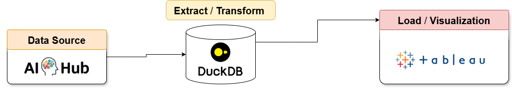

# 스타 스키마 실습

## 개요
- 6개월치의 카드 사용 금액 데이터셋을 사용하여 스타 스키마 구조를 생성하고 카드 사용금액 대시보드를 생성하였습니다.

## 데이터셋
- [AI 허브 사이트](https://www.aihub.or.kr/aihubdata/data/view.do?currMenu=115&topMenu=100&&srchDataRealmCode=REALM015&aihubDataSe=data&dataSetSn=71792)에서 제공하는 금융 합성 데이터를 활용하였습니다. 
- 총 12개의 압축 파일로 구성되어 있으며, 이 중 '**01.카드 회원정보**'와 '**03.카드 승인매출정보**' 데이터를 사용하였습니다.
- 각 파일들은  **2018년 7월부터 2018년 12월까지**의 6개의 CSV 파일들로 구성되어 있으며, 각 CSV 파일들은 **300만 건의 레코드**를 포함하고 있습니다.

## ERD 다이어그램

## 아키텍처

## 진행과정
  ### 1. 데이터 병합
  - 시각화 목적에 필요한 컬럼 추출
    - '**01. 카드 회원정보** 파일에서 79개 컬럼 중 6개의 컬럼 추출
    - '**03.카드 승인매출정보**' 파일에서 430개 컬럼 중 13개 컬럼 추출
    - 최종적으로 **1800만 건의 레코드**를 포함하는 테이블들을 2개 생성하였습니다.

